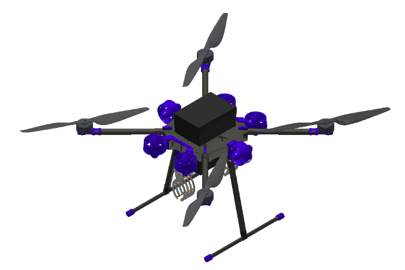
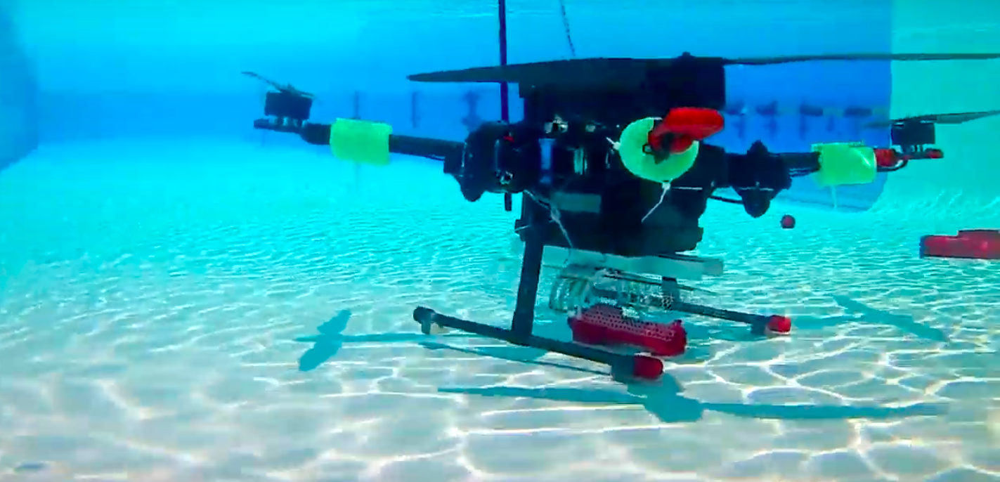
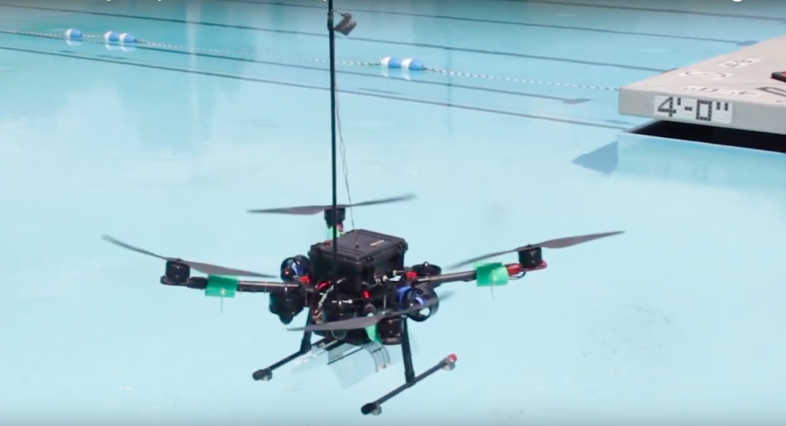

# Echo Technologies

## Problem Statement

*Previous ocean floor inspections, sampling, and recovery operations have been done by deploying a ship with a tethered vehicle to dive to the ocean floor. However, this method cannot be done without drawing unwanted attention to a potentially proprietary mission given a large ship is visible for all to see. Today’s technology still has not yet offered a solution as radio waves fail to penetrate the water to any useful depth.*

ECHO Technologies intends to design and build a hybrid underwater/aerial vehicle that can be deployed autonomously and/or wirelessly by using cutting edge control software along with a stable drone platform that can be used to secretively inspect the ocean floor.

## Underwater Subsystem

The underwater control system consists of:
- an Arduino
- 6 [Electronic Speed Controllers](https://www.bluerobotics.com/store/thrusters/speed-controllers/besc30-r3/) for 4 vertical and 2 horizontal motors
- an [Inertial Measurement Unit](https://learn.adafruit.com/adafruit-bno055-absolute-orientation-sensor/overview)
- a [Barometer](https://www.bluerobotics.com/store/electronics/bar02-sensor-r1-rp/)

All software for the Arduino can be found in the [underwater folder](https://github.com/tedklin/Echo/tree/master/Megalodon/src/underwater) of this repository. 

**The main file that synthesizes all algorithms is *[navigation](https://github.com/tedklin/Echo/tree/master/Megalodon/src/underwater/navigation/navigation.ino)*.**

**There is also an option for RC control with stability assistance: *[teleop](https://github.com/tedklin/Echo/blob/master/Megalodon/src/underwater/navigation/teleop.ino)*.**

## Vision Subsystem

The vision system consists of:
- a Raspberry Pi
- a [waterproof USB camera](https://www.amazon.com/dp/B07N5DX18T/ref=sspa_dk_detail_2?psc=1&pd_rd_i=B07N5DX18T)

The [vision folder](https://github.com/tedklin/Echo/tree/master/Megalodon/src/vision) contains code for full 3D pose estimation of visual fiducial markers known as [AprilTags](https://april.eecs.umich.edu/software/apriltag), as well as modified colored object detection based off of [NerdyVision](https://github.com/tedklin/nerdyvision).

The [vision algorithm](https://github.com/tedklin/Echo/blob/master/Megalodon/src/vision/color/NerdyVision2019.py) works in tandem with the underwater autonomous object retreival algorithm. We implemented a serial connection between the Raspberry Pi and the Arduino, which allows the Arduino to send data such as current robot pose and the Raspberry Pi to reply with data about the location and orientation of the object of interest.

## Aerial Subsystem

The aerial control system consists of:
- a [Pixhawk](http://pixhawk.org/) (autonomous) or [Eagle X6](https://www.motionrc.com/products/eagle-x6-6-axis-multi-rotor-flight-controller) (RC) flight controller 
- 4 [Electronic Speed Controllers](http://store-en.tmotor.com/goods.php?id=371)
- a [GPS](https://store.mrobotics.io/mRo-GPS-u-Blox-Neo-M8N-HMC5983-Compass-p/mro-gps004-mr.htm)

Given time constraints for this project, autonomous flight never became a reality. However, [significant work](https://github.com/tedklin/Echo/tree/master/Megalodon/src/aerial) was done on flight scripting with the **[dronekit-python](https://github.com/dronekit/dronekit-python)** library. Plans to integrate image processing with dronekit were also developed, but never fully implemented.

RC flight was successfully completed with the Eagle flight controller.

## Shared Hardware

To communicate with the drone, an [RC receiver system](https://www.horizonhobby.com/product/airplanes/telemetry-15066--1/aircraft-receivers/ar8010t-8ch-air-telemetry-receiver-spmar8010t) was implemented. This was used for the wireless RC mode of the Megalodon, as well as for a failsafe for autonomous operation. 

The claw that was used to grab objects was controlled by two [waterproof servos](https://www.bluerobotics.com/store/retired/hs-646wp/?fbclid=IwAR37Fxvrac2bqbgygsPXOxirx0ERk4Xt1Fn9HJPEAZ7LBNuF6v5u0TakOGY). These servos could be connected to either the RC receiver and the Arduino depending on desired mode of operation (human controlled or autonomous).

## Results

Our final product was able to perform all aspects of the mission with tele-operated control, as well as specific actions autonomously. Since the framework for putting together the automatic actions was already designed, I firmly believe that we could have completed the entire mission autonomously if we had more testing and tuning time. 

All in all, the mission was considered a success and heralded as one of the most impressive engineering feats our high school has ever seen.

Here's a [link to a documentary](https://youtu.be/Fxlh2qCpnxg) created by Leonel Tafoya, our Media Director, which summarizes Echo Technologies' entire journey.
